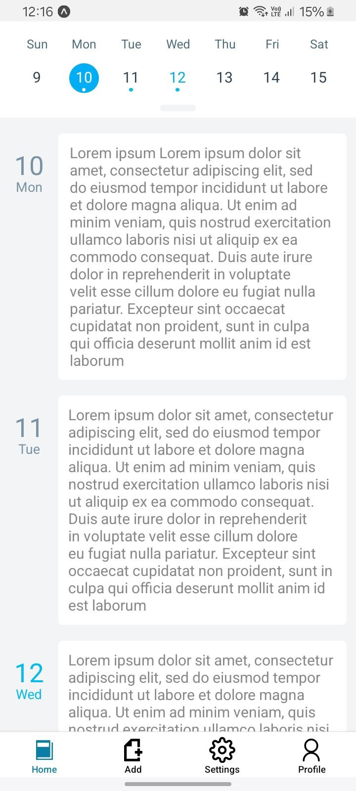
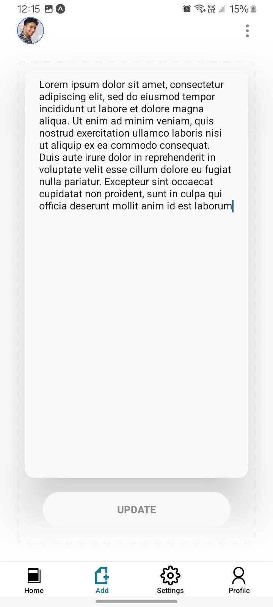
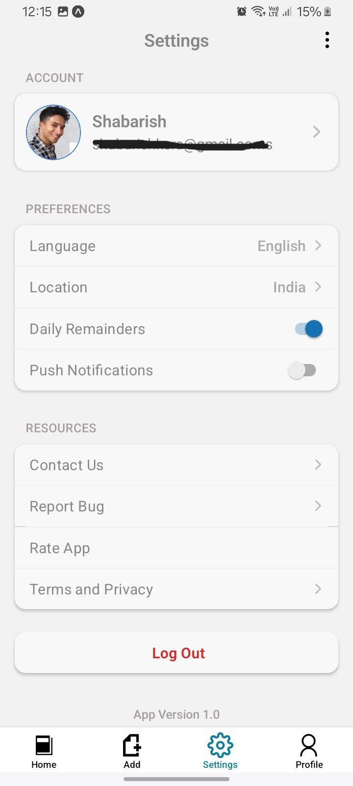
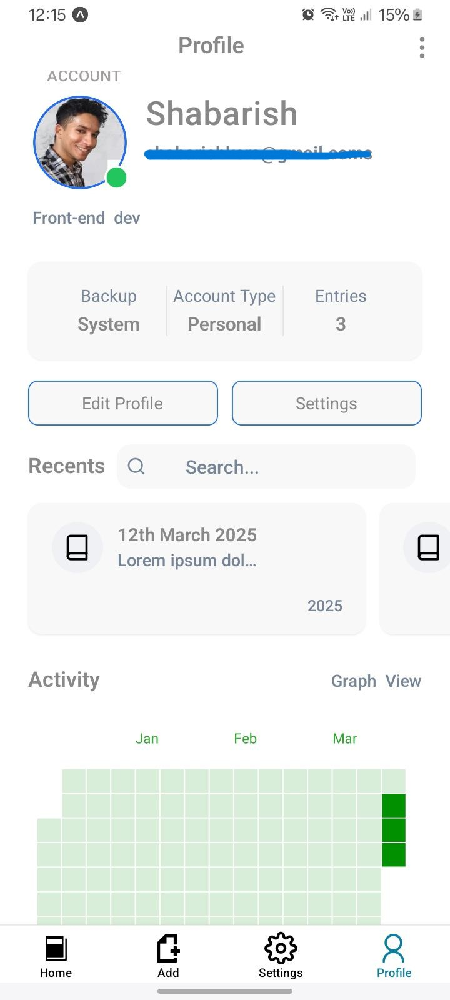
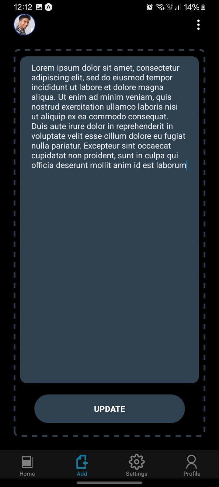
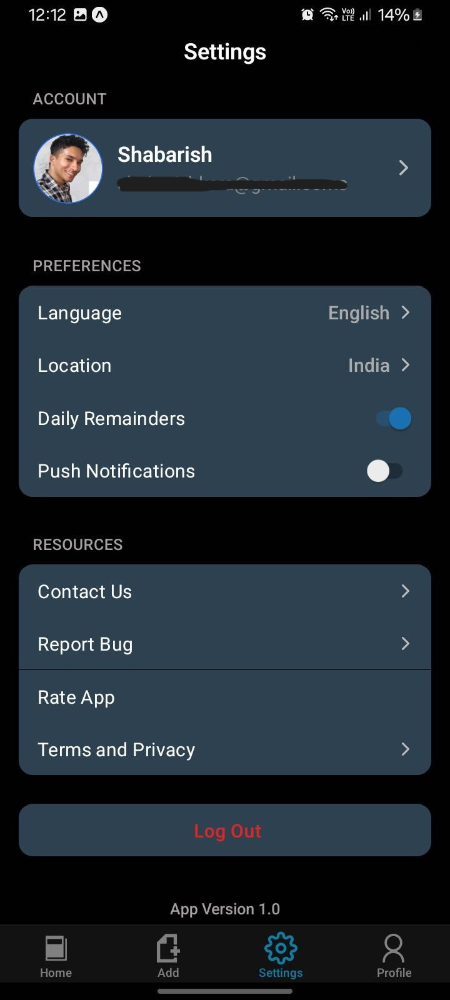
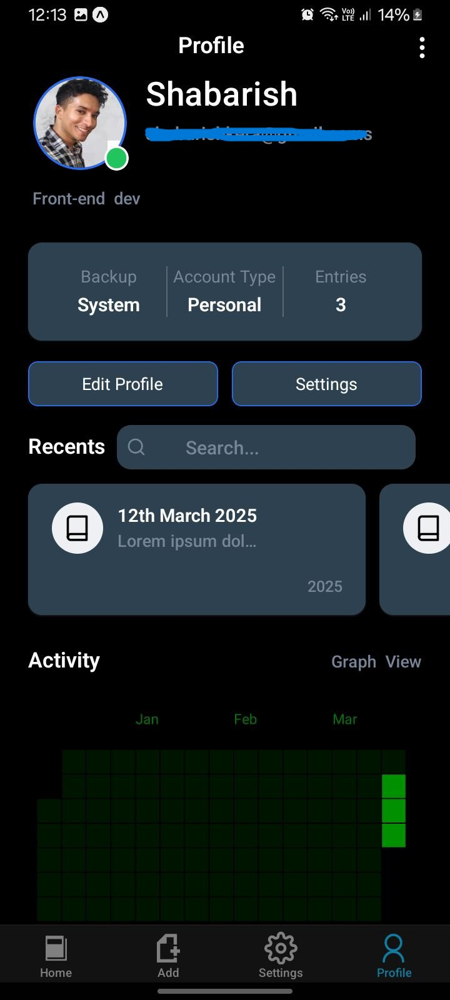

# Journal App 📔

A simple yet powerful journal app built using **React Native** and **Expo**. This app allows users to add, edit, delete, and view journal entries for each day. It also supports user authentication, where users can sign up and log in using their email and password. Multiple users are supported, and the app includes four main screens: **Home**, **Add**, **Settings**, and **Profile**.

## Features ✨

-   **CRUD Operations**: Add, Edit, Delete, and View journal entries. 📝
-   **User Authentication**: Users can log in using email and password. 🔒
-   **Multiple Users**: Supports multiple user accounts. 👥
-   **Screens**:
    -   **Home**: Displays the list of journal entries. 🏠
    -   **Add**: Allows users to add a new journal entry. ➕
    -   **Settings**: Customize the app settings. ⚙️
    -   **Profile**: View and edit user profile information. 🧑‍💻
-   **Light & Dark Themes**: The app supports both light and dark modes for a better user experience. 🌞🌜

## Screenshots 📸

### Light Theme 🌞

*Login screen in light theme.*

### Dark Theme 🌜

_Profile screen in dark theme._

## Installation 🛠️

Follow these steps to get the app up and running locally on your machine.

### Prerequisites 🚀

Ensure that you have the following installed:

-   [Expo CLI](https://docs.expo.dev/get-started/installation/)
-   A code editor like [Visual Studio Code](https://code.visualstudio.com/)
-   An Android/iOS simulator or a physical device to run the app

### Clone the Repository 🍴

Clone the repository to your local machine using the following command:

git clone https://github.com/shabarishkera/eJournal.git

Navigate into the project folder:

cd eJournal

### Install Dependencies 📦

Run the following command to install all the required dependencies:

npm install

### Start the Expo Project 🚀

Now, you can start the development server with Expo:

npm start

This will open the Expo development tools in your browser. You can scan the QR code to open the app on your phone, or you can run it in an emulator.

## Usage 🛠️

-   **Login**: Users can log in using their email and password. New users can sign up directly through the app. 🔑
-   **Home Screen**: Displays all journal entries with the option to add, edit, or delete entries. 📃
-   **Add Screen**: Allows users to create a new journal entry, including adding the date, title, and content. ✍️
-   **Settings**: Customize the app's appearance and other settings. ⚙️
-   **Profile**: View and update user information. 👤

## Contributing 🤝

Contributions are always welcome! If you have suggestions or improvements, feel free to fork the repository and create a pull request. Ensure you follow the code style and write tests for new features.

1. Fork the repository. 🍴
2. Create your feature branch (`git checkout -b feature-branch`). 🌱
3. Commit your changes (`git commit -m 'Add feature'`). ✨
4. Push to the branch (`git push origin feature-branch`). 🚀
5. Open a pull request. 🖋️

## License 📄

This project is licensed under the MIT License - see the [LICENSE](LICENSE) file for details.

---

Made with ❤️ using **React Native** and **Expo**. 🚀
